Load required packages


```r
suppressPackageStartupMessages({
    library(dplyr)
    library(ggplot2)
    library(reshape2)
})
```

Let's read the data into R Studio environment


```r
options(scipen=999)
setwd("F:\\E-learn\\Jigsaw\\EDA\\Practice Assignment")
contribution<-read.csv("contribution.csv")

dim(contribution)
```

```
## [1] 1230   11
```

```r
head(contribution)
```

```
##   Gender Class.Year Marital.Status       Major Next.Degree FY04Giving
## 1      M       1957              M     History         LLB       2500
## 2      M       1957              M     Physics          MS       5000
## 3      F       1957              M       Music        NONE       5000
## 4      M       1957              M     History        NONE          0
## 5      M       1957              M     Biology          MD       1000
## 6      F       1957              M Mathematics        NONE          0
##   FY03Giving FY02Giving FY01Giving FY00Giving AttendenceEvent
## 1       2500       1400      12060      12000               1
## 2       5000       5000       5000      10000               1
## 3       5000       5000       5000      10000               1
## 4       5100        200        200          0               1
## 5       1000       1000       1005       1000               1
## 6          0          0          0          0               0
```

```r
str(contribution)
```

```
## 'data.frame':	1230 obs. of  11 variables:
##  $ Gender         : Factor w/ 2 levels "F","M": 2 2 1 2 2 1 1 1 2 2 ...
##  $ Class.Year     : int  1957 1957 1957 1957 1957 1957 1957 1957 1957 1957 ...
##  $ Marital.Status : Factor w/ 4 levels "D","M","S","W": 2 2 2 2 2 2 3 2 2 2 ...
##  $ Major          : Factor w/ 46 levels "American Studies",..: 26 34 30 26 4 28 26 30 42 16 ...
##  $ Next.Degree    : Factor w/ 50 levels "AA","BA","BAE",..: 17 37 42 42 26 42 19 42 42 42 ...
##  $ FY04Giving     : num  2500 5000 5000 0 1000 0 0 100 100 0 ...
##  $ FY03Giving     : num  2500 5000 5000 5100 1000 0 0 100 100 0 ...
##  $ FY02Giving     : num  1400 5000 5000 200 1000 0 0 100 100 0 ...
##  $ FY01Giving     : num  12060 5000 5000 200 1005 ...
##  $ FY00Giving     : num  12000 10000 10000 0 1000 0 0 100 100 0 ...
##  $ AttendenceEvent: int  1 1 1 1 1 0 0 0 0 1 ...
```

```r
summary(contribution)
```

```
##  Gender    Class.Year   Marital.Status               Major      Next.Degree 
##  F:615   Min.   :1957   D: 78          History          :135   NONE   :460  
##  M:615   1st Qu.:1967   M:711          English          :123   MA     :135  
##          Median :1987   S:428          Biology          :115   JD     :103  
##          Mean   :1981   W: 13          Economics        : 87   PHD    :100  
##          3rd Qu.:1997                  Political Science: 81   NDA    : 72  
##          Max.   :1997                  Psychology       : 79   MS     : 65  
##                                        (Other)          :610   (Other):295  
##    FY04Giving        FY03Giving        FY02Giving        FY01Giving      
##  Min.   :    0.0   Min.   :    0.0   Min.   :    0.0   Min.   :     0.0  
##  1st Qu.:    0.0   1st Qu.:    0.0   1st Qu.:    0.0   1st Qu.:     0.0  
##  Median :    0.0   Median :    0.0   Median :    0.0   Median :     0.0  
##  Mean   :  159.4   Mean   :  241.5   Mean   :  133.5   Mean   :   276.5  
##  3rd Qu.:   75.0   3rd Qu.:   75.0   3rd Qu.:   51.0   3rd Qu.:    75.0  
##  Max.   :14655.2   Max.   :58785.5   Max.   :11187.3   Max.   :161370.1  
##                                                                          
##    FY00Giving      AttendenceEvent 
##  Min.   :    0.0   Min.   :0.0000  
##  1st Qu.:    0.0   1st Qu.:0.0000  
##  Median :    0.0   Median :1.0000  
##  Mean   :  169.2   Mean   :0.6041  
##  3rd Qu.:   60.0   3rd Qu.:1.0000  
##  Max.   :21000.0   Max.   :1.0000  
## 
```


### Analysing contributions

We will now create a variable for analysing the contributions across all years by the alumni.


```r
contribution%>%mutate(Contributions=FY04Giving+FY03Giving+FY02Giving+FY01Giving+FY00Giving)->contribution
dim(contribution)
```

```
## [1] 1230   12
```


We will first do analysis at an aggregate level. Finding out how total contributions are distributed by Gender, Batch, Marital Status etc.

1. Gender


```r
contribution%>%group_by(Gender)%>%summarise(Count=n(),Percentage_Count=n()/1230,Total_Contribution=sum(Contributions),Percentage_Contribution=Total_Contribution/1205454,Average=mean(Contributions))%>%ungroup()%>%arrange(-Total_Contribution)
```

```
## # A tibble: 2 x 6
##   Gender Count Percentage_Count Total_Contribution Percentage_Contribut~ Average
##   <fct>  <int>            <dbl>              <dbl>                 <dbl>   <dbl>
## 1 M        615              0.5            841302.                 0.698   1368.
## 2 F        615              0.5            364151.                 0.302    592.
```

**Males appear to be the majority contributors while being as many in number as females**

2. Batch


```r
contribution%>%group_by(Class.Year)%>%summarise(Count=n(),Percentage_Count=n()/1230,Total_Contribution=sum(Contributions),Percentage_Contribution=Total_Contribution/1205454,Average=mean(Contributions))%>%ungroup()%>%arrange(-Total_Contribution)
```

```
## # A tibble: 5 x 6
##   Class.Year Count Percentage_Count Total_Contributi~ Percentage_Contri~ Average
##        <int> <int>            <dbl>             <dbl>              <dbl>   <dbl>
## 1       1957   127            0.103           560507.             0.465   4413. 
## 2       1967   222            0.180           293751.             0.244   1323. 
## 3       1977   243            0.198           210769.             0.175    867. 
## 4       1987   277            0.225           105288.             0.0873   380. 
## 5       1997   361            0.293            35139.             0.0291    97.3
```

**This result is expected, alumni who have passed a long time ago are the ones who are contributing the most. Also notice that they comprise only 10% of the student base**

3. Marital Status


```r
contribution%>%group_by(Marital.Status)%>%summarise(Count=n(),Percentage_Count=n()/1230,Total_Contribution=sum(Contributions),Percentage_Contribution=Total_Contribution/1205454,Average=mean(Contributions))%>%ungroup()%>%arrange(-Total_Contribution)
```

```
## # A tibble: 4 x 6
##   Marital.Status Count Percentage_Count Total_Contribut~ Percentage_Cont~
##   <fct>          <int>            <dbl>            <dbl>            <dbl>
## 1 M                711           0.578           941985.           0.781 
## 2 W                 13           0.0106          102181.           0.0848
## 3 S                428           0.348            81773.           0.0678
## 4 D                 78           0.0634           79515            0.0660
## # ... with 1 more variable: Average <dbl>
```

**Married people contribute the most and are also the largest group by count**

4. Major


```r
contribution%>%group_by(Major)%>%summarise(Count=n(),Percentage_Count=n()/1230,Total_Contribution=sum(Contributions),Percentage_Contribution=Total_Contribution/1205454,Average=mean(Contributions))%>%ungroup()%>%arrange(-Total_Contribution)
```

```
## # A tibble: 46 x 6
##    Major      Count Percentage_Count Total_Contribut~ Percentage_Contri~ Average
##    <fct>      <int>            <dbl>            <dbl>              <dbl>   <dbl>
##  1 History      135          0.110            240617.             0.200    1782.
##  2 Mathemati~     3          0.00244          172710.             0.143   57570.
##  3 Economics~    24          0.0195           104032.             0.0863   4335.
##  4 Economics     87          0.0707           101522.             0.0842   1167.
##  5 Speech (D~     7          0.00569           74895.             0.0621  10699.
##  6 Biology      115          0.0935            63365.             0.0526    551.
##  7 Political~    81          0.0659            58243.             0.0483    719.
##  8 English      123          0.1               48854.             0.0405    397.
##  9 Psychology    79          0.0642            43807.             0.0363    555.
## 10 Physics       21          0.0171            38685              0.0321   1842.
## # ... with 36 more rows
```

**History majors are the highest contributors followed by Mathematics and Econonmics**

5. Next degree


```r
contribution%>%group_by(Next.Degree)%>%summarise(Count=n(),Percentage_Count=n()/1230,Total_Contribution=sum(Contributions),Percentage_Contribution=Total_Contribution/1205454,Average=mean(Contributions))%>%ungroup()%>%arrange(-Total_Contribution)
```

```
## # A tibble: 50 x 6
##    Next.Degree Count Percentage_Count Total_Contributi~ Percentage_Cont~ Average
##    <fct>       <int>            <dbl>             <dbl>            <dbl>   <dbl>
##  1 NONE          460          0.374             341875.           0.284     743.
##  2 JD            103          0.0837            219143.           0.182    2128.
##  3 MBA            43          0.0350            148805.           0.123    3461.
##  4 PHD           100          0.0813            127989.           0.106    1280.
##  5 MS             65          0.0528             87733            0.0728   1350.
##  6 MD             48          0.0390             61961.           0.0514   1291.
##  7 MA            135          0.110              50189            0.0416    372.
##  8 LLB             2          0.00163            31342            0.0260  15671 
##  9 TC             30          0.0244             27838            0.0231    928.
## 10 ME             20          0.0163             17380            0.0144    869 
## # ... with 40 more rows
```

**People who didn't go on to pursue any degree further are the largest contributors**

6. Attendence Event


```r
contribution%>%group_by(AttendenceEvent)%>%summarise(Count=n(),Percentage_Count=n()/1230,Total_Contribution=sum(Contributions),Percentage_Contribution=Total_Contribution/1205454,Average=mean(Contributions))%>%ungroup()%>%arrange(-Total_Contribution)
```

```
## # A tibble: 2 x 6
##   AttendenceEvent Count Percentage_Count Total_Contribut~ Percentage_Cont~
##             <int> <int>            <dbl>            <dbl>            <dbl>
## 1               1   743            0.604         1102842.           0.915 
## 2               0   487            0.396          102612.           0.0851
## # ... with 1 more variable: Average <dbl>
```

**This result is again expected, people who come to fundraising events they contribute the most**


Now we will look at how total contributions are changing over the years


```r
contribution%>%summarize(FY04=sum(FY04Giving),FY03=sum(FY03Giving),FY02=sum(FY02Giving),FY01=sum(FY01Giving),FY00=sum(FY00Giving))%>%melt()->tot_cont
```

```
## No id variables; using all as measure variables
```

```r
names(tot_cont)<-c("Year","Contribution")
tot_cont$Per_Cont<-round(tot_cont$Contribution/1205454,2)
tot_cont$Cumu_Contr<-cumsum(tot_cont$Per_Cont)

p<-ggplot(tot_cont,aes(x=Year,y=Contribution,fill=Year))
p+geom_bar(stat="identity",alpha=0.7)+geom_text(aes(label=Per_Cont,colour=Per_Cont),vjust=-0.3)+theme_classic()+scale_fill_discrete(c=50,h=c(1,250),h.start =50 )+guides(color=FALSE)
```

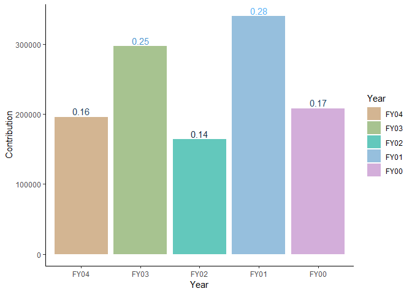<!-- -->

**It seems like that total contributions are variable and there is no constant trend.**


### Year wise Analysis


We will now look at total contribution year wise by:

1. Gender
2. Batch
3. Marital Status
4. Attendence at fundrasing events
5. Major

We will focus on the contributors only.


##### Gender

The contribution break up year wise according to gender along with count and percentage count is as follows:


```r
contribution%>%filter(FY04Giving>0)%>%group_by(Gender)%>%summarise(Count=n(),Percentage_Count=n()/507,Total_Contribution=sum(FY04Giving),Percentage_Contribution=round(Total_Contribution/196061.8,2),Average=mean(FY04Giving))%>%ungroup()%>%arrange(-Total_Contribution)%>%mutate(Contribution.Year=rep("FY04",2))%>%data.frame()->GFY04

contribution%>%filter(FY03Giving>0)%>%group_by(Gender)%>%summarise(Count=n(),Percentage_Count=n()/531,Total_Contribution=sum(FY03Giving),Percentage_Contribution=round(Total_Contribution/297013.8,2) ,Average=mean(FY03Giving))%>%ungroup()%>%arrange(-Total_Contribution)%>%mutate(Contribution.Year=rep("FY03",2))%>%data.frame()->GFY03


contribution%>%filter(FY02Giving>0)%>%group_by(Gender)%>%summarise(Count=n(),Percentage_Count=n()/548,Total_Contribution=sum(FY02Giving),Percentage_Contribution=round(Total_Contribution/164153.8,2) ,Average=mean(FY02Giving))%>%ungroup()%>%arrange(-Total_Contribution)%>%mutate(Contribution.Year=rep("FY02",2))%>%data.frame()->GFY02


contribution%>%filter(FY01Giving>0)%>%group_by(Gender)%>%summarise(Count=n(),Percentage_Count=n()/600,Total_Contribution=sum(FY01Giving),Percentage_Contribution=round(Total_Contribution/340130.6,2),Average=mean(FY01Giving))%>%ungroup()%>%arrange(-Total_Contribution)%>%mutate(Contribution.Year=rep("FY01",2))%>%data.frame()->GFY01

contribution%>%filter(FY00Giving>0)%>%group_by(Gender)%>%summarise(Count=n(),Percentage_Count=n()/539,Total_Contribution=sum(FY00Giving),Percentage_Contribution=round(Total_Contribution/208093.6,2 ),Average=mean(FY00Giving))%>%ungroup()%>%arrange(-Total_Contribution)%>%mutate(Contribution.Year=rep("FY00",2))%>%data.frame()->GFY00

Gender<-rbind(GFY00,GFY01,GFY02,GFY03,GFY04)

p<-ggplot(Gender,aes(x=Contribution.Year,y=Total_Contribution,fill=Gender))
(Contrib<-p+geom_bar(stat="identity",position="stack",alpha=0.5)+geom_text(aes(label=Percentage_Contribution),position="stack",vjust=2)+theme_classic()+scale_fill_discrete(c=50,h =c(1,100),h.start = 50,direction = -1)+ggtitle("Contribution by Gender"))
```

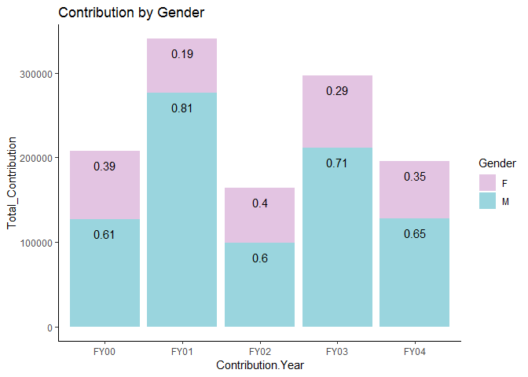<!-- -->

```r
l<-ggplot(Gender,aes(x=Contribution.Year,y=Percentage_Count,group=Gender,colour=Gender))
(PerCount<-l+geom_line()+theme_classic()+ggtitle("Percentage Number of Males and Females")+scale_color_discrete(c=50,h =c(1,100),h.start = 50,direction = -1)+xlab("Contribution Year")+ylab("Percent Count"))
```

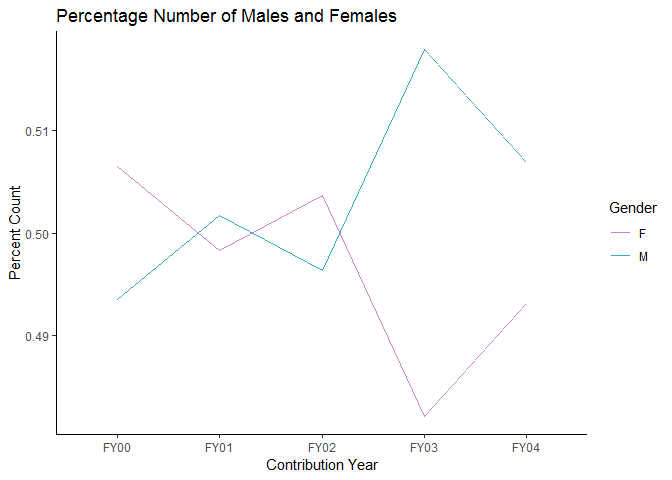<!-- -->

```r
(TotCount<-l+geom_line(aes(y=Count))+theme_classic()+ggtitle("Total Number of Males and Females")+scale_color_discrete(c=50,h =c(1,100),h.start = 50,direction = -1)+xlab("Contribution Year")+ylab("Total Count"))
```

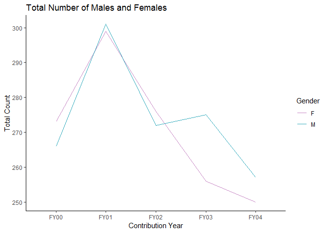<!-- -->

**Clearly male alumni are the major contributors and the proportion of contribution split is relatively less volatile**

##### Batch

The contribution break up year wise according to batch along with count and percentage count is as follows:

```r
contribution%>%filter(FY04Giving>0)%>%group_by(Class.Year)%>%summarise(Count=n(),Percentage_Count=n()/507,Total_Contribution=sum(FY04Giving),Percentage_Contribution=round(Total_Contribution/196061.8,2),Average=mean(FY04Giving))%>%ungroup()%>%arrange(-Total_Contribution)%>%mutate(Contribution.Year="FY04")%>%data.frame()->CLY04

contribution%>%filter(FY03Giving>0)%>%group_by(Class.Year)%>%summarise(Count=n(),Percentage_Count=n()/531,Total_Contribution=sum(FY03Giving),Percentage_Contribution=round(Total_Contribution/297013.8,2) ,Average=mean(FY03Giving))%>%ungroup()%>%arrange(-Total_Contribution)%>%mutate(Contribution.Year="FY03")%>%data.frame()->CLY03


contribution%>%filter(FY02Giving>0)%>%group_by(Class.Year)%>%summarise(Count=n(),Percentage_Count=n()/548,Total_Contribution=sum(FY02Giving),Percentage_Contribution=round(Total_Contribution/164153.8,2) ,Average=mean(FY02Giving))%>%ungroup()%>%arrange(-Total_Contribution)%>%mutate(Contribution.Year="FY02")%>%data.frame()->CLY02


contribution%>%filter(FY01Giving>0)%>%group_by(Class.Year)%>%summarise(Count=n(),Percentage_Count=n()/600,Total_Contribution=sum(FY01Giving),Percentage_Contribution=round(Total_Contribution/340130.6,2),Average=mean(FY01Giving))%>%ungroup()%>%arrange(-Total_Contribution)%>%mutate(Contribution.Year="FY01")%>%data.frame()->CLY01

contribution%>%filter(FY00Giving>0)%>%group_by(Class.Year)%>%summarise(Count=n(),Percentage_Count=n()/539,Total_Contribution=sum(FY00Giving),Percentage_Contribution=round(Total_Contribution/208093.6,2 ),Average=mean(FY00Giving))%>%ungroup()%>%arrange(-Total_Contribution)%>%mutate(Contribution.Year="FY00")%>%data.frame()->CLY00

Class<-rbind(CLY00,CLY01,CLY02,CLY03,CLY04)
Class$Class.Year<-as.factor(Class$Class.Year)

p<-ggplot(Class,aes(x=Contribution.Year,y=Total_Contribution,fill=Class.Year))
(Contrib<-p+geom_bar(stat="identity",position="stack",alpha=0.8)+theme_light()+scale_fill_discrete(c=50,h=c(1,300),h.start = 50)+ggtitle("Contribution By Batch")+ylab("Total Contribution in $")+xlab("Contribution Year"))
```

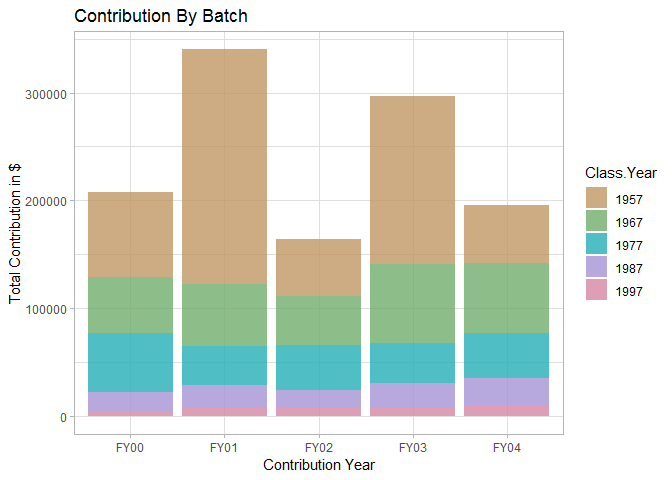<!-- -->

```r
l<-ggplot(Class,aes(x=Contribution.Year,y=Percentage_Count,group=Class.Year,colour=Class.Year))
(PerCount<-l+geom_line()+theme_classic()+ggtitle("Percentage Number of Alumni By Batch")+xlab("Contribution Year")+ylab("Percent Count")+scale_color_discrete(c=50,h=c(1,300),h.start = 50))
```

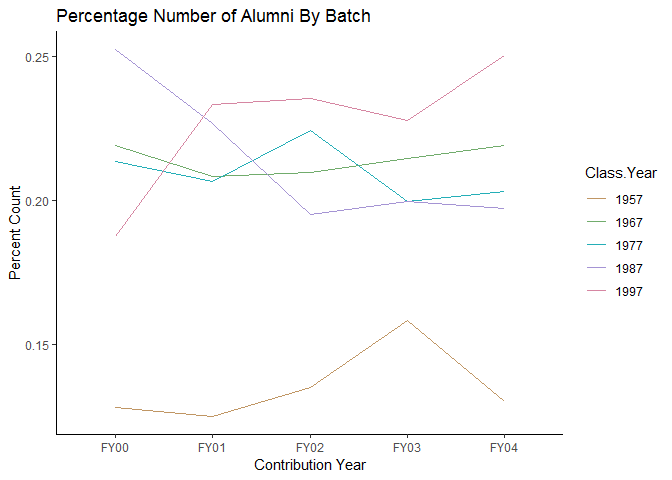<!-- -->

```r
(TotCount<-l+geom_line(aes(y=Count))+theme_classic()+ggtitle("Total Number of Alumni By Batch")+ylab("Total Count")+xlab("Contribution Year")+scale_color_discrete(c=50,h=c(1,300),h.start = 50))
```

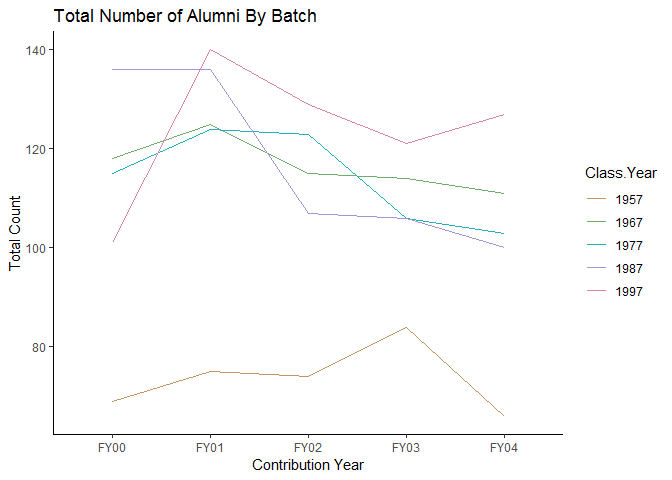<!-- -->

**The proportion of alumni from the batch of 1957 is low but we can see that the contribution by this batch is disproportionately more than others**

##### Marital Status

The contribution break up year wise according to marital status along with count and percentage count is as follows


```r
contribution%>%filter(FY04Giving>0)%>%group_by(Marital.Status)%>%summarise(Count=n(),Percentage_Count=n()/507,Total_Contribution=sum(FY04Giving),Percentage_Contribution=round(Total_Contribution/196061.8,2),Average=mean(FY04Giving))%>%ungroup()%>%arrange(-Total_Contribution)%>%mutate(Contribution.Year="FY04")%>%data.frame()->MSY04

contribution%>%filter(FY03Giving>0)%>%group_by(Marital.Status)%>%summarise(Count=n(),Percentage_Count=n()/531,Total_Contribution=sum(FY03Giving),Percentage_Contribution=round(Total_Contribution/297013.8,2) ,Average=mean(FY03Giving))%>%ungroup()%>%arrange(-Total_Contribution)%>%mutate(Contribution.Year="FY03")%>%data.frame()->MSY03


contribution%>%filter(FY02Giving>0)%>%group_by(Marital.Status)%>%summarise(Count=n(),Percentage_Count=n()/548,Total_Contribution=sum(FY02Giving),Percentage_Contribution=round(Total_Contribution/164153.8,2) ,Average=mean(FY02Giving))%>%ungroup()%>%arrange(-Total_Contribution)%>%mutate(Contribution.Year="FY02")%>%data.frame()->MSY02


contribution%>%filter(FY01Giving>0)%>%group_by(Marital.Status)%>%summarise(Count=n(),Percentage_Count=n()/600,Total_Contribution=sum(FY01Giving),Percentage_Contribution=round(Total_Contribution/340130.6,2),Average=mean(FY01Giving))%>%ungroup()%>%arrange(-Total_Contribution)%>%mutate(Contribution.Year="FY01")%>%data.frame()->MSY01

contribution%>%filter(FY00Giving>0)%>%group_by(Marital.Status)%>%summarise(Count=n(),Percentage_Count=n()/539,Total_Contribution=sum(FY00Giving),Percentage_Contribution=round(Total_Contribution/208093.6,2 ),Average=mean(FY00Giving))%>%ungroup()%>%arrange(-Total_Contribution)%>%mutate(Contribution.Year="FY00")%>%data.frame()->MSY00

Marital<-rbind(MSY00,MSY01,MSY02,MSY03,MSY04)

p<-ggplot(Marital,aes(x=Contribution.Year,y=Total_Contribution,fill=Marital.Status))
(Contrib<-p+geom_bar(stat="identity",alpha=0.6)+theme_light()+scale_fill_discrete(c=50,h=c(1,250),h.start =50)+ylab("Total Contribution in $")+xlab("Contribution Year")+ggtitle("Contribution by Marital Status"))
```

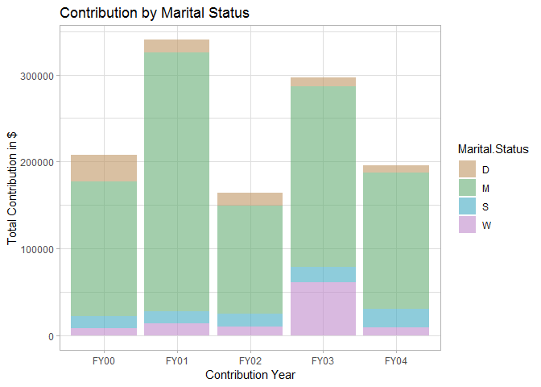<!-- -->

```r
l<-ggplot(Marital,aes(x=Contribution.Year,y=Percentage_Count,group=Marital.Status,colour=Marital.Status))
(PerCount<-l+geom_line()+theme_classic()+ggtitle("Percentage Number of Alumni by Marital Status")+xlab("Contribution Year")+ylab("Percent Count")+scale_color_discrete(c=50,h=c(1,250),h.start =50))
```

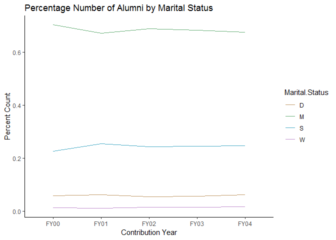<!-- -->

```r
(TotCount<-l+geom_line(aes(y=Count))+theme_classic()+ggtitle("Total Number of Alumni by Marital Status")+ylab("Total Count")+xlab("Contribution Year")+scale_color_discrete(c=50,h=c(1,250),h.start =50))
```

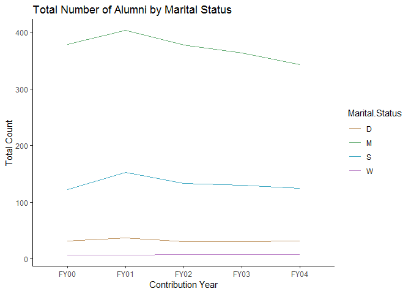<!-- -->

**Married people are major contributors. And the trend is persistent, its the married people who are contributing a lot. But we can also observe that although divorced alumni are lesser in number compared to single alumni but the dollar amount contributed is similar to the group of people who are single.**


##### Attendence At Fund Raising Events

The contribution break up year wise according to attendence along with count and percentage count is as follows:


```r
contribution%>%filter(FY04Giving>0)%>%group_by(AttendenceEvent)%>%summarise(Count=n(),Percentage_Count=n()/507,Total_Contribution=sum(FY04Giving),Percentage_Contribution=round(Total_Contribution/196061.8,2),Average=mean(FY04Giving))%>%ungroup()%>%arrange(-Total_Contribution)%>%mutate(Contribution.Year="FY04")%>%data.frame()->ATY04

contribution%>%filter(FY03Giving>0)%>%group_by(AttendenceEvent)%>%summarise(Count=n(),Percentage_Count=n()/531,Total_Contribution=sum(FY03Giving),Percentage_Contribution=round(Total_Contribution/297013.8,2) ,Average=mean(FY03Giving))%>%ungroup()%>%arrange(-Total_Contribution)%>%mutate(Contribution.Year="FY03")%>%data.frame()->ATY03


contribution%>%filter(FY02Giving>0)%>%group_by(AttendenceEvent)%>%summarise(Count=n(),Percentage_Count=n()/548,Total_Contribution=sum(FY02Giving),Percentage_Contribution=round(Total_Contribution/164153.8,2) ,Average=mean(FY02Giving))%>%ungroup()%>%arrange(-Total_Contribution)%>%mutate(Contribution.Year="FY02")%>%data.frame()->ATY02


contribution%>%filter(FY01Giving>0)%>%group_by(AttendenceEvent)%>%summarise(Count=n(),Percentage_Count=n()/600,Total_Contribution=sum(FY01Giving),Percentage_Contribution=round(Total_Contribution/340130.6,2),Average=mean(FY01Giving))%>%ungroup()%>%arrange(-Total_Contribution)%>%mutate(Contribution.Year="FY01")%>%data.frame()->ATY01

contribution%>%filter(FY00Giving>0)%>%group_by(AttendenceEvent)%>%summarise(Count=n(),Percentage_Count=n()/539,Total_Contribution=sum(FY00Giving),Percentage_Contribution=round(Total_Contribution/208093.6,2 ),Average=mean(FY00Giving))%>%ungroup()%>%arrange(-Total_Contribution)%>%mutate(Contribution.Year="FY00")%>%data.frame()->ATY00

Attendence<-rbind(ATY00,ATY01,ATY02,ATY03,ATY04)
Attendence$AttendenceEvent<-as.factor(Attendence$AttendenceEvent)

p<-ggplot(Attendence,aes(x=Contribution.Year,y=Total_Contribution,fill=AttendenceEvent))
(Contrib<-p+geom_bar(stat="identity",position="stack",alpha=0.8)+theme_light()+scale_fill_discrete(c=50,h=c(1,100),h.start=50)+ylab("Total Contribution in $")+xlab("Contribution Year")+ggtitle("Contribution by Attendence Status"))
```

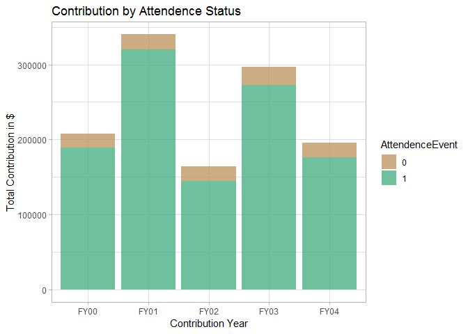<!-- -->

```r
l<-ggplot(Attendence,aes(x=Contribution.Year,y=Percentage_Count,group=AttendenceEvent,colour=AttendenceEvent))
(PerCount<-l+geom_line(size=1.2)+theme_classic()+ggtitle("Percentage Number of Alumni by Attendence Status")+xlab("Contribution Year")+ylab("Percent Count")+scale_color_discrete(c=50,h=c(1,100),h.start=50))
```

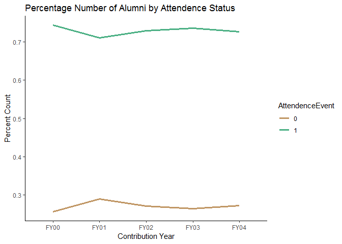<!-- -->

```r
(TotCount<-l+geom_line(aes(y=Count),size=1.2)+theme_classic()+ggtitle("Total Number of Alumni by Attendence Status")+ylab("Total Count")+xlab("Contribution Year")+scale_color_discrete(c=50,h=c(1,100),h.start=50))
```

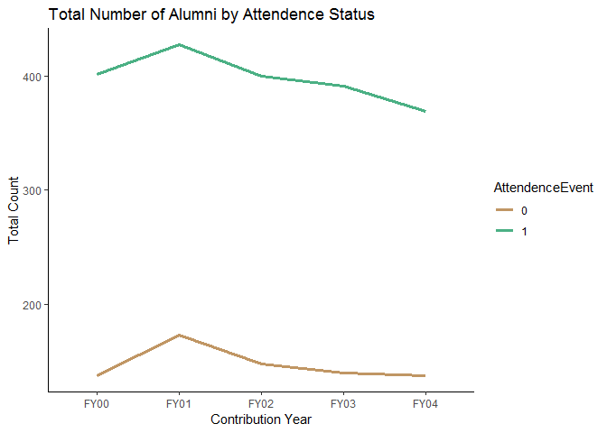<!-- -->

**There is a constant trend in amount contributed by people who attend events. The count of people attending the events is also same across all the years.**

##### Major

The contribution break up year wise according to Major along with count and percentage count is as follows: (For this analysis we chose only those students who contributed more than 8% in a given year)


```r
contribution%>%filter(FY04Giving>0)%>%group_by(Major)%>%summarise(Count=n(),Percentage_Count=n()/507,Total_Contribution=sum(FY04Giving),Percentage_Contribution=round(Total_Contribution/196061.8,2),Average=mean(FY04Giving))%>%ungroup()%>%arrange(-Total_Contribution)%>%mutate(Contribution.Year="FY04")%>%data.frame()->MY04

contribution%>%filter(FY03Giving>0)%>%group_by(Major)%>%summarise(Count=n(),Percentage_Count=n()/531,Total_Contribution=sum(FY03Giving),Percentage_Contribution=round(Total_Contribution/297013.8,2) ,Average=mean(FY03Giving))%>%ungroup()%>%arrange(-Total_Contribution)%>%mutate(Contribution.Year="FY03")%>%data.frame()->MY03


contribution%>%filter(FY02Giving>0)%>%group_by(Major)%>%summarise(Count=n(),Percentage_Count=n()/548,Total_Contribution=sum(FY02Giving),Percentage_Contribution=round(Total_Contribution/164153.8,2) ,Average=mean(FY02Giving))%>%ungroup()%>%arrange(-Total_Contribution)%>%mutate(Contribution.Year="FY02")%>%data.frame()->MY02


contribution%>%filter(FY01Giving>0)%>%group_by(Major)%>%summarise(Count=n(),Percentage_Count=n()/600,Total_Contribution=sum(FY01Giving),Percentage_Contribution=round(Total_Contribution/340130.6,2),Average=mean(FY01Giving))%>%ungroup()%>%arrange(-Total_Contribution)%>%mutate(Contribution.Year="FY01")%>%data.frame()->MY01

contribution%>%filter(FY00Giving>0)%>%group_by(Major)%>%summarise(Count=n(),Percentage_Count=n()/539,Total_Contribution=sum(FY00Giving),Percentage_Contribution=round(Total_Contribution/208093.6,2 ),Average=mean(FY00Giving))%>%ungroup()%>%arrange(-Total_Contribution)%>%mutate(Contribution.Year="FY00")%>%data.frame()->MY00

Major<-rbind(MY00,MY01,MY02,MY03,MY04)

p<-ggplot(Major%>%filter(Percentage_Contribution>0.08),aes(x=Contribution.Year,y=Total_Contribution,fill=Major))
(Contrib<-p+geom_bar(stat="identity",position="stack",alpha=0.6)+theme_classic()+ggtitle("Contribution break up by Major: Mninmum contribution of 8%")+scale_fill_discrete(h.start=50,c=50)+ylab("Total Contribution")+xlab("Contribution Year"))
```

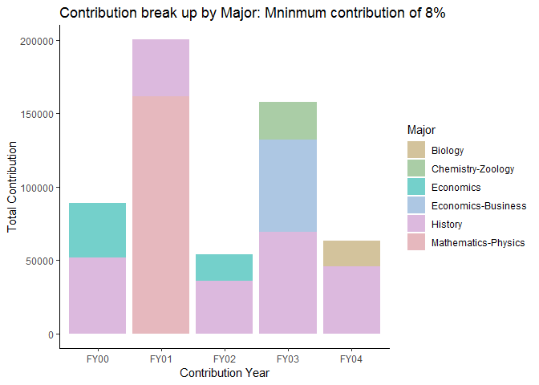<!-- -->

```r
l<-ggplot(Major%>%filter(Percentage_Contribution>0.08),aes(x=Contribution.Year,y=Percentage_Count,group=Major,colour=Major))
(PerCount<-l+geom_line()+theme_classic()+ggtitle("Percentage Number of Alumni by Major")+xlab("Contribution Year")+ylab("Percent Count")+geom_point(size=5)+scale_color_discrete(h.start=50,c=50))
```

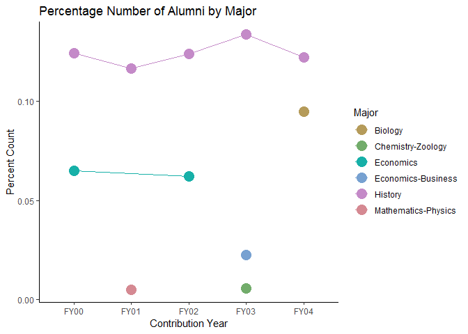<!-- -->

```r
(TotCount<-l+geom_line(aes(y=Count))+theme_classic()+ggtitle("Total Number of Alumni by Major")+ylab("Total Count")+xlab("Contribution Year")+geom_point(aes(y=Count),size=5)+scale_color_discrete(h.start=50,c=50))
```

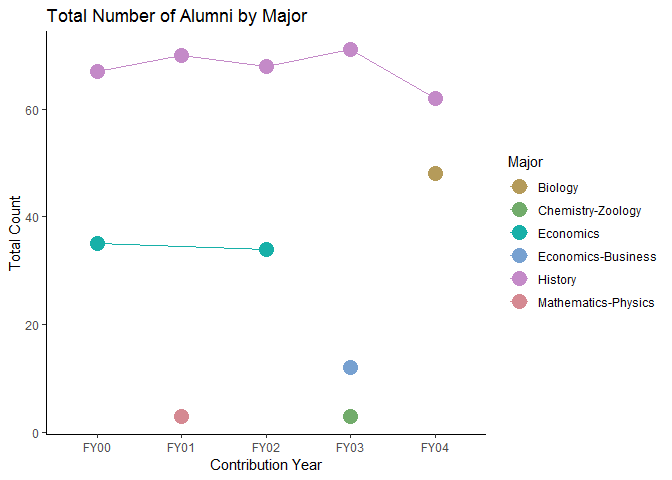<!-- -->

**Most contributions come from History majors and there seems to be some persistence in the trend. The large contribution in FY01 by a Mathematics-Physics major seems like a one off affair.**
